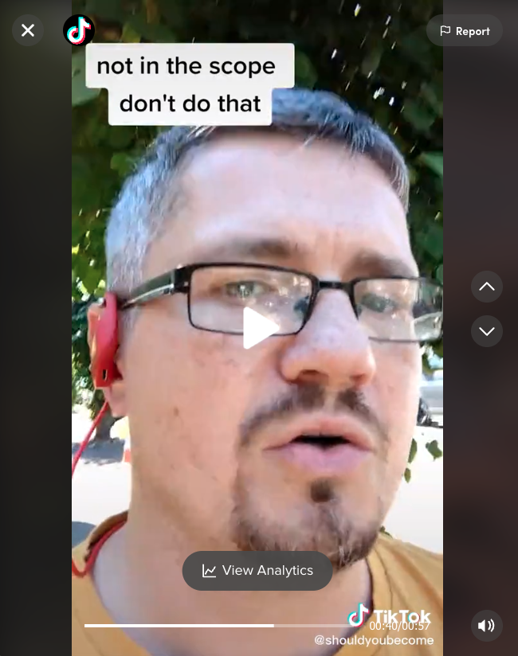

## Łukasz Marek Sielski (sielay or Wookie 🐻)

<table><tr><td width="75%" valign="top" colspan="2">
 
 * Code for over 20+ years
 * Pascal 👉 Delphi 👉 C# 👉 PHP 👉 JavaScript 👉 TypeScript)
 * Grew up together with the web
 * Learner and imposter forever
 * Wrote a book for people interested in the IT [Should you Become a Software Developer?](https://becomingdeveloper.com)
 * Head of Software Development CMS, buidling editorial tools for [@mailonline](https://github.com/MailOnline)
 * Got few badges for OS projects
 * Contribute because I use
 * Publish because I love to contribute

 </td>
 <td width="25%" valign="top" rowspan="2">
  
 ### Twitter 
  
  * 🤖 [@CodeRebased](https://twitter.com/CodeRebased) 
  * 💬 [@sielay](https://twitter.com/sielay)
  * 🚴 [@phonekills](https://twitter.com/phonekills)
  
 ### Websites
  
   * 👨‍💻 [Virtual CTO](https://becomingdeveloper.com/cto)
   * 📖 [Book](https://becomingdeveloper.com)
   * 🥼 [Shouldyou.co](https://shouldyou.co) Expierment
   * 📵 [PhoneKills](https://phonekills.co.uk) Road Safety
   * 🕸️ [Unloved blog](https://sielay.com)
  
 ### Mastodon
  
  * 🤖 [@becomingdeveloper@techhub.social](https://techhub.social/@becomingdeveloper)
  * 💬 [@sielay@masto.ai](https://masto.ai/@sielay)
  * 🚴 [@phonekills@c.im](https://c.im/@phonekills)
  
 ### Other social
  
 * 💼 [LinkedIn](https://linkedin.com/in/sielay)
 * 🎥 [TikTok](http://tiktok.com/@shouldyoubecomedeveloper) 
 * 📹 [YouTube](https://www.youtube.com/channel/UChzpCoVwXu2ii_UQkuGEQGQ)
 * 🤳 [Instagram](https://www.instagram.com/shouldyoubecomedeveloper/)
 * 🤡 [Facebook](https://www.facebook.com/becomingdeveloper/)
  
 </td>
 </tr>
 <tr><td>
  
  
  </td><td>
  
   
  
  </td></tr>
</table> 
